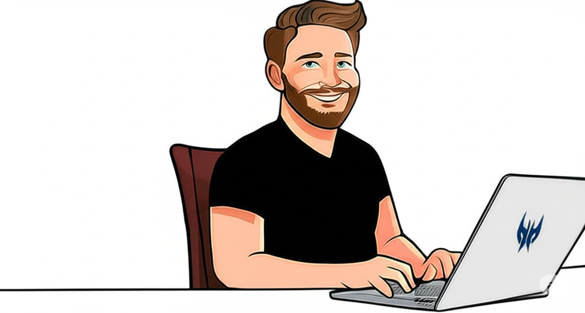
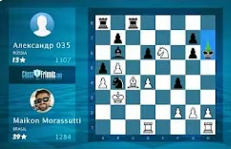

<h3 align="center">
Maikon Morassutti
</h3>

<h4 align="center">
Desenvolvedor Full Stack • Engenheiro de Produção • Coordenador de Engenharia de Processos • Project Manager
</h4>

<!-- Secção de contacto -->

👨‍💻 Sobre Mim
👋 Olá! Me chamo Maikon Morassutti e sou um Desenvolvedor Full Stack, com formação em Engenharia de Produção e Administração de empresas com pós-graduação em Engenharia de Computação e Segurança cibernética.

🎯 O meu objetivo atual é aprofundar-me em arquitetura de sistemas para me tornar um Arquiteto de Software. Além de me profissionalizar no Xadrez através do Mensa Brasil.

🏢 Atualmente, atuo como Coordenador de Engenharia de Processos na Plotter-Racks e também como Desenvolvedor Full Stack de forma independente.

🧠 Integrante do Mensa - QI 148

💬 Adoro interagir com novas pessoas, partilhar conhecimentos e aprender continuamente.

🚀 Tecnologias e Ferramentas

🏢 Projetos em que já atuei:
<!-- Logos com altura padronizada, espaçamento e links corrigidos -->

&nbsp;&nbsp;&nbsp;&nbsp;
&nbsp;&nbsp;&nbsp;&nbsp;
&nbsp;&nbsp;&nbsp;&nbsp;

📊 Minhas Estatísticas do GitHub

🎬 Meu Último Vídeo no YouTube

<strong>▶️ JOGO DIFICIL, JOGADO ATÉ O FINAL!!!</strong>

Quer ver mais vídeos sobre xadrez e outros tópicos? <a href="https://www.youtube.com/@maikonmorassutti4847" target="_blank">Visite o meu canal!</a>

